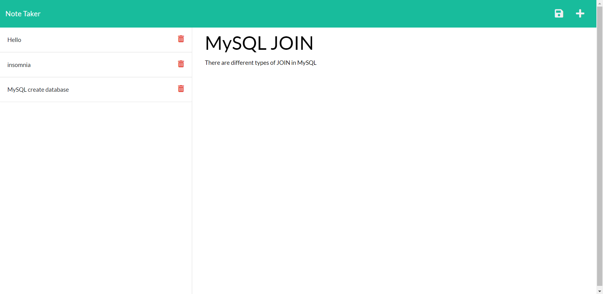

# Note Taker

## Description

This is an application that allows the user to create, save, and delete notes on one page. The site starts off on a landing page where the user can click on the button to start taking notes and to see their previous entries. The left column shows all of the notes that the user had previously written; each note can be clicked on to display it on the bigger, right column for more details. The trash can button is available to delete any notes that are not needed anymore.

To create a note, users can click on the + button on the top right to start making a new note; upon page load, it will default automatically to making a new note until the user clicks on a note from the list. Once their note has been created with both the title and text, the user can click on the save button that appears on the top right to save it in the list. The notes list will then be updated with the new entry!

## Process

The application has front-end and back-end sides that create routes to each other. The front-end sends a request to the back-end, which then takes that request and sends a response based off of the action submitted.

## Usage

## Links

The live app deployed using Heroku can be found here: (insert placeholder text)

The GitHub repository can be found here: [https://github.com/cindyung56/note-taker](https://github.com/cindyung56/note-taker)